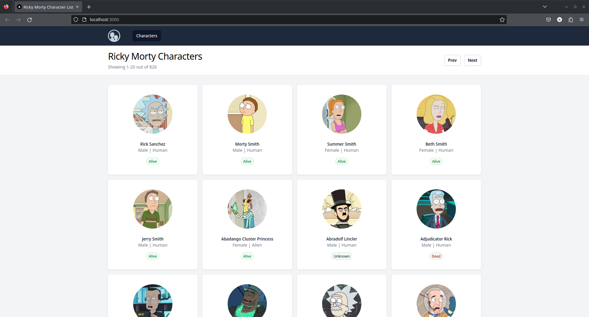

Turbo Repo for all the nextjs projects

## Links to the Readme for the projects in this Monorepo:

### Rick and Morty Frontend

- Display the characters and their properties with pagination in the television show Rick and Morty
  

[Click here for Detailed Info](./apps/ricky-monty-api-frontend/README.md)

### Delimiter Viewer

- Provides a form that can parse the delimited image URLs
  
- Provides a Gallery view of the Image URLs
  
- Can save the image to Firebase in path `image/<domain-name>/<path-name>.jpg`
  
- Can copy the Firebase URL to clipboard

[Click here for Detailed Info](./apps/delimiter-viewer/README.md)

## Learning in Monorepo using Turborepo

- By using monorepo, I've harnessed the advantages of a modular structure to streamline development across various projects.
- One standout example of this is the creation of the package/firebase-client module. By centralizing my Firebase-related code and configurations in this package, I've simplified the setup process for other projects within this monorepo.
- In addition to the benefits of modularization, being a monorepo also offers another practical advantage. The .prettierrc configuration file, applied uniformly across all repositories within this monorepo, ensures consistent and well-formatted Tailwind CSS classes, simplifying maintenance and enhancing code readability.
